# KU Cafe Menu

[Indian Food](#indian-food) | [Korean Food](#korean-food) | [Thai Food](#thai-food) | [Japanese Food](#japanese-food)

## Indian Food Menu

| Name                | Description                                                         | Images                                                                                                                          | Price(Baht) |
|:--------------------|---------------------------------------------------------------------|---------------------------------------------------------------------------------------------------------------------------------|-------------|
| Malai Kofta         | Mild gravy with deepfried potato and paneer balls                   |                   | 240฿         |
| Paneer Tikka Masala | paneer in spicy gravy with tomatoes, cream, coconut cream and masala. |         | 250฿         |
| Aloo Gobi           | Potato cauliflower curry                                            |  | 180฿         |
| Dal Makhani         | Urad dal, Rajma, butter and spices thick soup.                      |                                 | 180฿         |

## Korean Food

| Name            | Description                                                                                                                                                                                                                  | Image                                          | Price |
|:----------------|------------------------------------------------------------------------------------------------------------------------------------------------------------------------------------------------------------------------------|------------------------------------------------|-------|
| **Kimchi**      | Kimchi is a traditional Korean fermented dish made from vegetables, primarily napa cabbage, seasoned with a mixture of spices and seasonings, resulting in a flavorful and tangy condiment                                   | 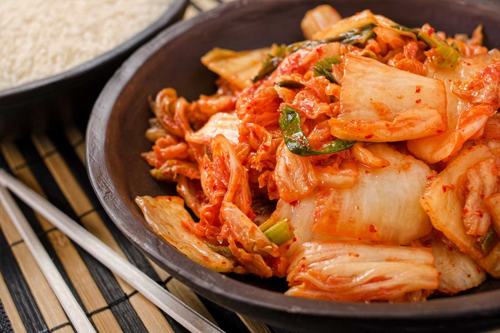      | 30฿   |
| **Bibimbap**    | Bibimbap is a Korean dish consisting of a vibrant assortment of sauteed vegetables, meat, or tofu, served over a bed of rice and often topped with a fried egg, and mixed together with spicy gochujang sauce before eating. | 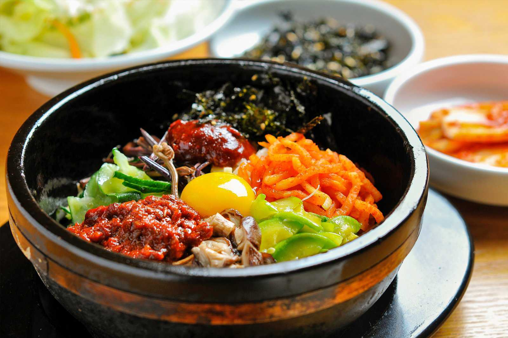    | 60฿   |
| **Tteokbokki**  | Tteokbokki is a popular Korean street food made from chewy rice cakes cooked in a spicy and savory gochujang sauce, offering a delightful blend of flavors and textures.                                                     |   | 120฿  |
| **Bulgogi**     | a Korean dish consisting of rice topped with sautéed vegetables, chili paste, and beef or other meat, sometimes with the addition of a raw or fried egg.                                                                     | 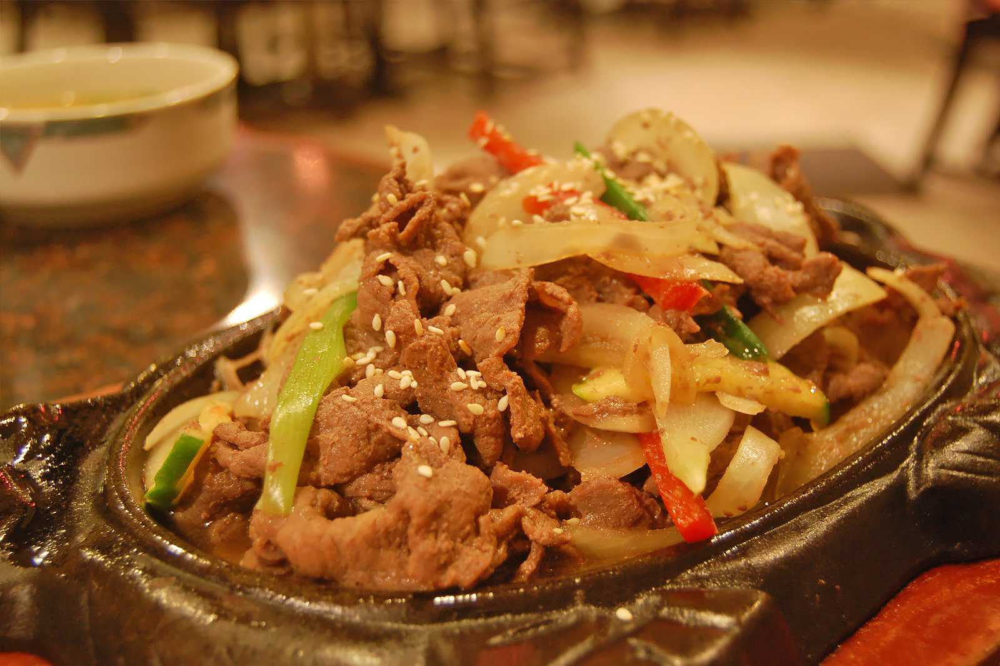     | 150฿  |
| **Samgyeopsal** | Samgyeopsal is another staple Korean dish that requires few culinary skills, where chunky slices of pork belly are cooked on a grill at the diners’ table.                                                                   | 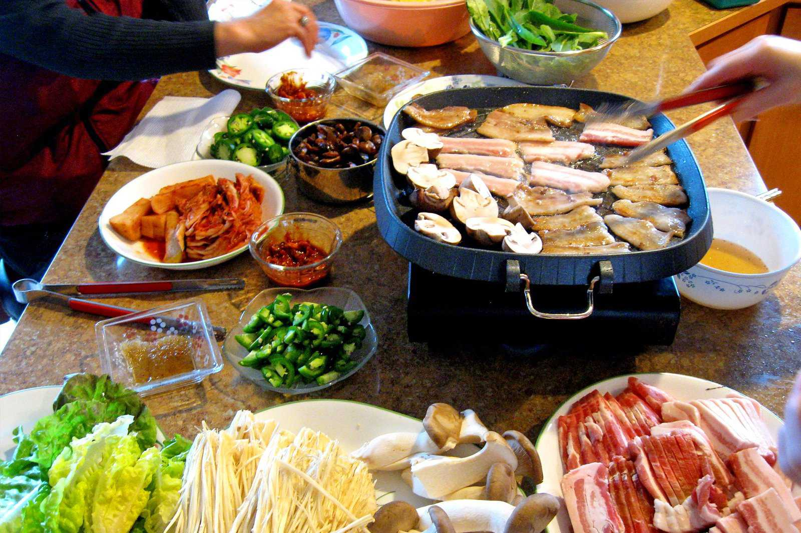 | 200฿  |

## Japanese Food

|Name    | Description | Images | Price(Baht) |
|:------|:----------|-------------|----:| 
| Katsudon | Katsudon is a popular Japanese dish consisting of tonkatsu and eggs served over rice.   |   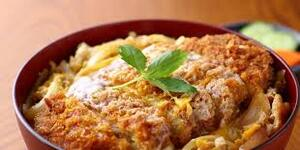  |  169฿|
| Oyakodon | Japanese rice bowl dish, in which chicken, egg, sliced scallion, and other ingredients are all simmered together in a kind of soup, and then served on top of a large bowl of rice.  | 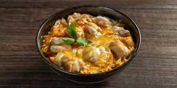 | 149฿ |
| Salmon donburi | Salmon Donburi is a delicious Japanese rice bowl topped with tender salmon fillets with hints of lemon and garlic to make the perfect salty-sweet complement. | 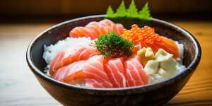 | 189฿ |
| Okonomiyaki  | A savory pancake and is made with vegetables, meat, seafood, and other ingredients, cooked on a griddle with flour-based batter and served with special sauce. | 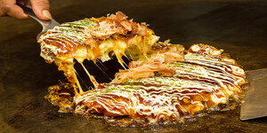 | 159฿ |

## Thai Food

| Name          | Description                                                                                                                                                                                                                                                                | Image                                          | Price |
|:--------------|----------------------------------------------------------------------------------------------------------------------------------------------------------------------------------------------------------------------------------------------------------------------------|------------------------------------------------|------:|
| Tom Yum Goong | Tom Yum Goong is a spicy and sour Thai soup made with prawns, lemongrass, kaffir lime leaves, galangal, and Thai chilies. The broth is tangy with lime juice and fish sauce, and it's often garnished with cilantro, offering a vibrant taste of traditional Thai flavors. |  |  150฿ |
| Panang Gai    | Panang Gai is a creamy, mildly spicy Thai curry made with tender chicken, rich coconut milk, and fragrant Panang curry paste. It’s flavored with kaffir lime leaves and often garnished with Thai basil, offering a slightly sweet and nutty taste.                        | 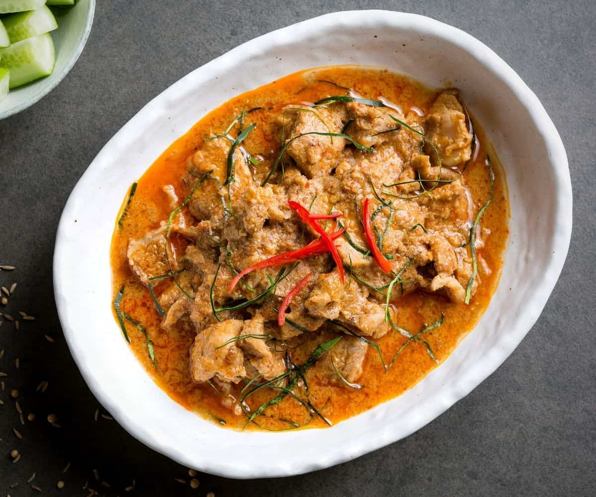    |   50฿ |
| Pad Ka Prao   | Pad Ka Prao is a spicy Thai stir-fry made with minced meat (usually pork or chicken), fresh Thai basil, garlic, and chilies. It's savory, aromatic, and often served with rice and a fried egg on top.                                                                     | 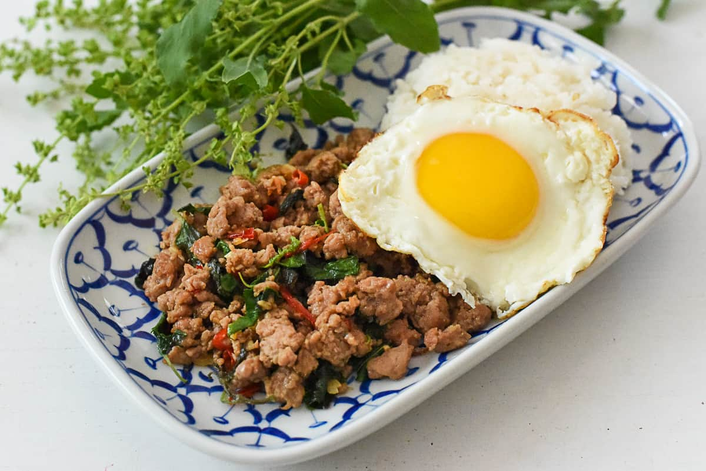   |   45฿ |
| Som Tam       | Som Tam is a spicy and tangy Thai green papaya salad made with shredded papaya, chilies, lime, fish sauce, and peanuts. It’s a refreshing dish with a perfect balance of sweet, sour, and spicy flavors.                                                                   |        |   70฿ |
| Nam Tok Moo   | Nam Tok Moo is a spicy Thai salad made with grilled pork, tossed with lime juice, fish sauce, chilies, and fresh herbs like mint and cilantro. It's a flavorful dish with a mix of tangy, spicy, and savory notes.                                                         | 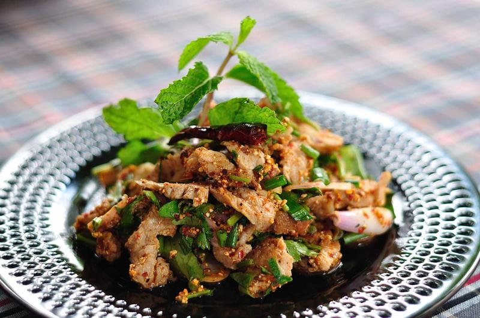    |   65฿ |

## Beverages

| Name        | Description                                                                                                                                                                                                                              | Image                                                                                                            | Price |
|:------------|------------------------------------------------------------------------------------------------------------------------------------------------------------------------------------------------------------------------------------------|------------------------------------------------------------------------------------------------------------------|------:|
| Cha Yen     | Cha Yen is a Thai iced tea made with strongly brewed black tea, sweetened with condensed milk, and served over ice. It has a rich, creamy flavor with a hint of vanilla and a distinctive orange color.                                  | 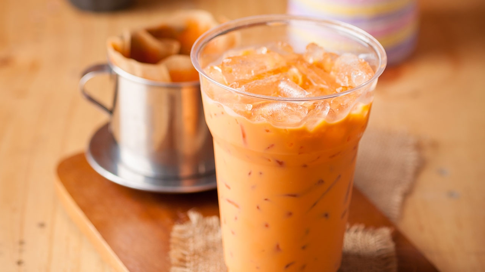                                                                         |   30฿ |
| Masala Chai | ginger, cardamom, nutmeg, cinnamon, cloves, black pepper, black tea leaves, hot water and hot milk.                                                                                                                                      |  |  350฿ |
| Soju        | soju is distilled from fermented rice, or optionally wheat, barley, sweet potatoes, or tapioca. It is believed that it initially appeared when Mongols introduced the distilling technique to the Koreans, sometime in the 13th century. |                                                                           |  135฿ |
| Calpis | Calpis is a popular non-carbonated soft drink in Japan that is enjoyed by people of all ages. |  | 25฿ |

