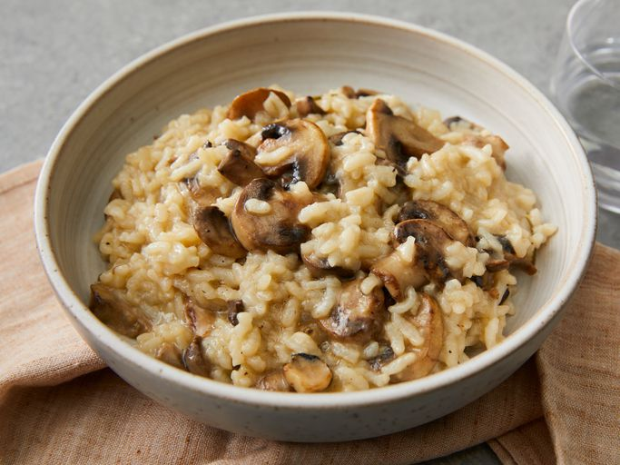
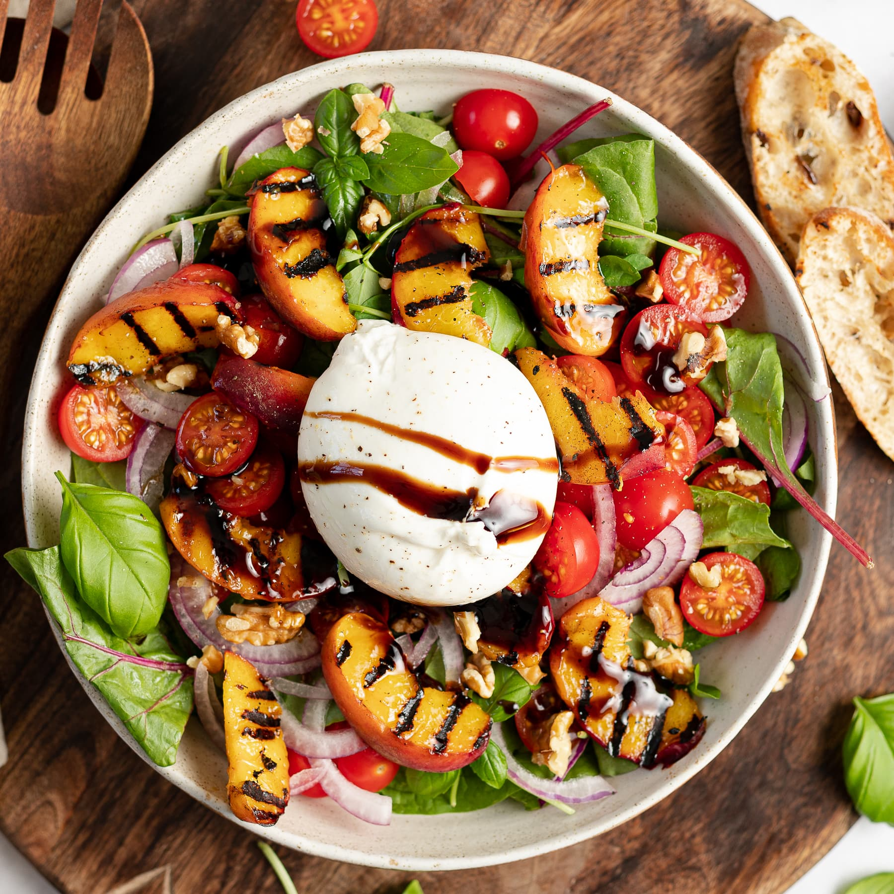
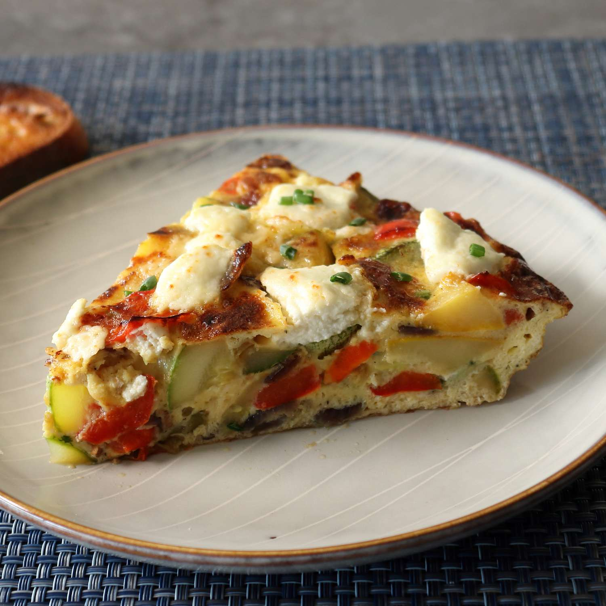
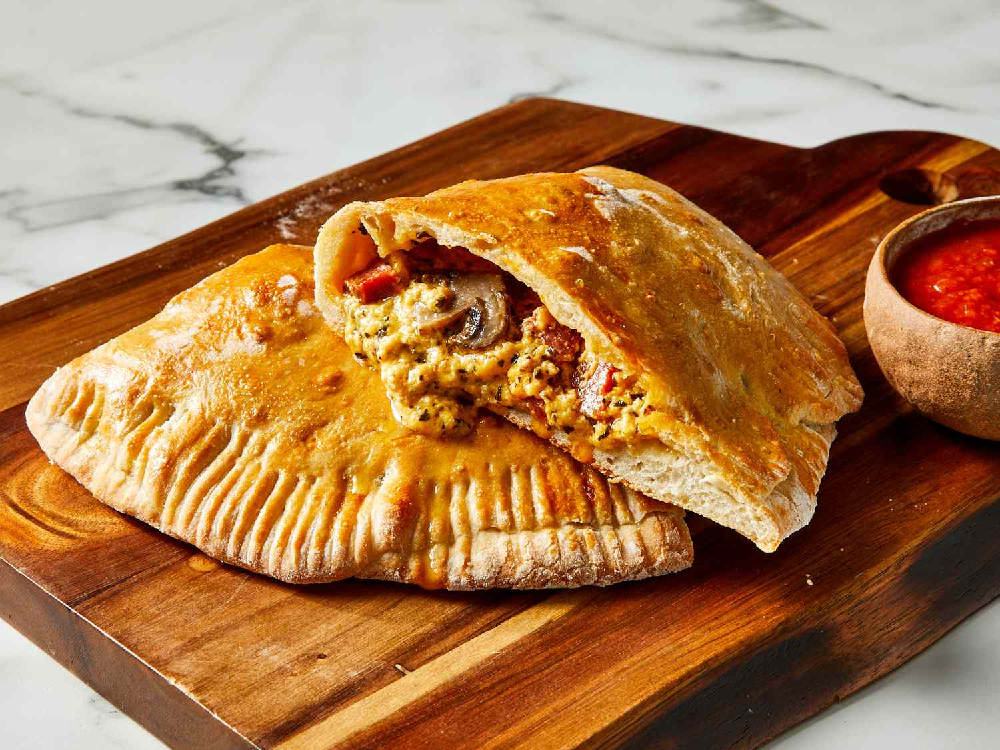
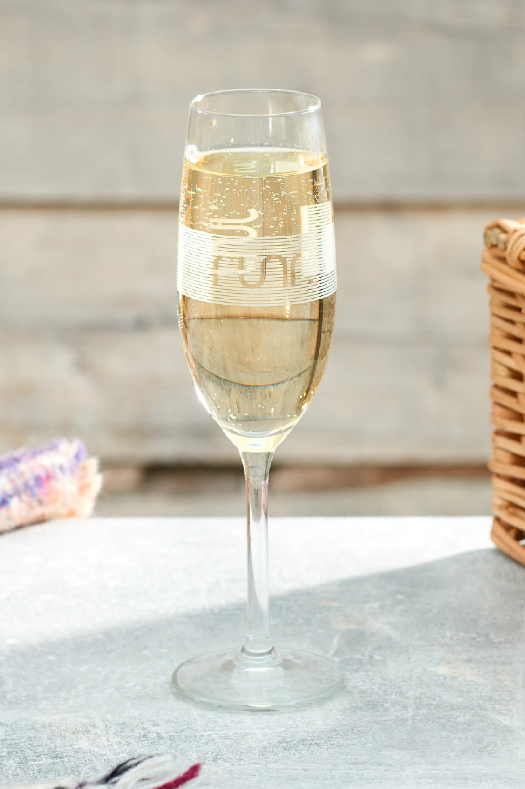

# KU Cafe Menu
[Italian Food](#italian-food) |

## Italian food

| Name                    | Description                                                                                                                                                                                                                                                        | Image                                        |  Price |
|:------------------------|--------------------------------------------------------------------------------------------------------------------------------------------------------------------------------------------------------------------------------------------------------------------|----------------------------------------------|-------:|
| **Risotto**             | An Italian dish made by cooking a starchy, short grain rice like arborio with stock until it becomes creamy.                                                                                                                                                       |    |   100฿ |
| **Spaghetti Carbonara** | An Italian main course consisting of spaghetti (long thin strands of pasta) with bacon and a creamy sauce made from eggs, Pecorino or Parmesan and black pepper.                                                                                                   |  |    90฿ |
| **Burrata Salad**       | A Burrata Salad is a fresh and vibrant dish that showcases the creamy richness of burrata cheese. Typically served with a mix of ripe, juicy tomatoes, such as heirloom or cherry varieties.                                                                       |    |    80฿ |
| **Frittata**            | A versatile Italian egg dish that is similar to an omelette or crustless quiche but with its own unique characteristics. It is typically made by whisking eggs together and then mixing in a variety of ingredients such as vegetables, cheeses, meats, and herbs. |   |    70฿ |
| **Calzones**            | A popular Italian dish that resembles a folded pizza. Made from pizza dough, a calzone is typically stuffed with a variety of ingredients, then folded in half to create a crescent shape before being baked until golden and crispy on the outside.               |   |    90฿ |

## Beverages
| Name                    | Description                                                                                                                                                                                      | Image                                       | Price |
|:------------------------|--------------------------------------------------------------------------------------------------------------------------------------------------------------------------------------------------|---------------------------------------------|------:|
| **Prosecco**             | A sparkling white wine from northern Italy, Prosecco’s popularity has grown massively over the last decade. Today, it’s one of the most famous Italian drinks inside and outside the country.    |  |   100฿ |
