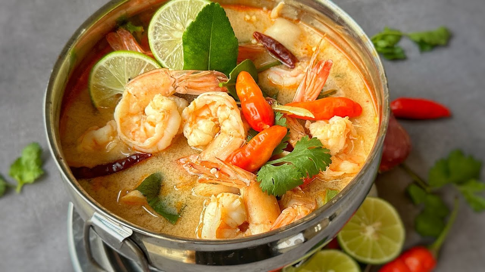

# KU Cafe Menu
[Thai Food](#thai-food) | [Indian Food](#Indian Food)

## Thai Food

| Name          | Description                                                                                                                                                                                                                                                                | Image                                          | Price |
|:--------------|----------------------------------------------------------------------------------------------------------------------------------------------------------------------------------------------------------------------------------------------------------------------------|------------------------------------------------|------:|
| Tom Yum Goong | Tom Yum Goong is a spicy and sour Thai soup made with prawns, lemongrass, kaffir lime leaves, galangal, and Thai chilies. The broth is tangy with lime juice and fish sauce, and it's often garnished with cilantro, offering a vibrant taste of traditional Thai flavors. |  |  150฿ |
| Panang Gai    | Panang Gai is a creamy, mildly spicy Thai curry made with tender chicken, rich coconut milk, and fragrant Panang curry paste. It’s flavored with kaffir lime leaves and often garnished with Thai basil, offering a slightly sweet and nutty taste.                        |     |   50฿ |
| Pad Ka Prao   | Pad Ka Prao is a spicy Thai stir-fry made with minced meat (usually pork or chicken), fresh Thai basil, garlic, and chilies. It's savory, aromatic, and often served with rice and a fried egg on top.                                                                     |    |   45฿ |
| Som Tam       | Som Tam is a spicy and tangy Thai green papaya salad made with shredded papaya, chilies, lime, fish sauce, and peanuts. It’s a refreshing dish with a perfect balance of sweet, sour, and spicy flavors.                                                                   |        |   70฿ |
| Nam Tok Moo   | Nam Tok Moo is a spicy Thai salad made with grilled pork, tossed with lime juice, fish sauce, chilies, and fresh herbs like mint and cilantro. It's a flavorful dish with a mix of tangy, spicy, and savory notes.                                                         |     |   65฿ |

## Indian Food Menu
| Name                | Description                                                         | Images                                                                                                          | Price(Baht) |
|:--------------------|---------------------------------------------------------------------|-----------------------------------------------------------------------------------------------------------------|-------------|
| Malai Kofta         | Mild gravy with deepfried potato and paneer balls                   |  | 240฿         |
| Paneer Tikka Masala | paneer in spicy gravy with tomatoes, cream, coconut cream and masala. |       | 250฿         |
| Aloo Gobi           | Potato cauliflower curry                                            |  | 180฿         |
| Dal Makhani         | Urad dal, Rajma, butter and spices thick soup.                      |                               | 180฿         |

